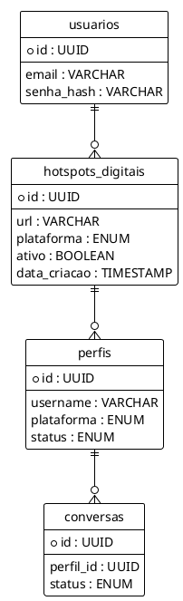

# PLANO DE DESENVOLVIMENTO E MVP DO PROJETO QUIMERA

Este documento é o **Plano Mestre Unificado** da Arquitetura do Projeto Quimera, focado no engajamento e relacionamento social automatizado.

## 1. Visão Geral (Engajamento Social Automatizado)
O **Projeto Quimera** é um ecossistema desenvolvido para automação de perfis sociais, captação de métricas de compatibilidade e persuasão (focado no público de Varginha, MG). Opera com mimetismo humano absoluto via **Playwright**, OSINT ("Etnografia Digital") e LLMs.

## 2. Casos de Uso Core e MVP
* **CU01 - Prospecção e Batedor (Scout)**: O usuário parametriza os "Hotspots". O **Agente Batedor** via Playwright qualifica contas.
* **CU02 - Roteamento de Hotspot (API)**: O Operador envia requisições HTTP para gerenciar as localidades.
* **CU03 - Análise de Perfil**: Avalia bios, frequência em locais, e gera o Proxy de Compatibilidade.
* **CU04 - Interação e Persuasão**: Sistema envia Directs via Agente Escriba (Push & Pull).
* **CU05 - Human Handoff**: Se a pontuação atinge maturidade, o robô transfere o chat.

## 3. Diagrama UML e Modelagem de Dados

O banco principal usa **PostgreSQL**. Abaixo o modelo relacional abstraído do domínio:

## 4. Endpoints MVP
* **POST /api/v1/hotspots** (Command) -> Salva um novo local para varredura.
* **GET /api/v1/hotspots** (Query) -> Lista Hotspots cadastrados ativos.

## 5. Diretrizes de Engenharia
1. **Playwright sobre Selenium:** Todo scraper deve usar a infraestrutura baseada em WebSockets (CDP) do Playwright para garantir performance e baixa detecção bot.
2. **Arquitetura Limpa:** Padrões `DDD` e `CQRS` devem ser mantidos. A camada `api` não executa SQL direta, delegando a repositórios da `infrastructure/`.
3. **Restrições:** Código Python 3.11+, tipagem estrita com Pydantic, classes abstratas e complexidade menor que 10.
